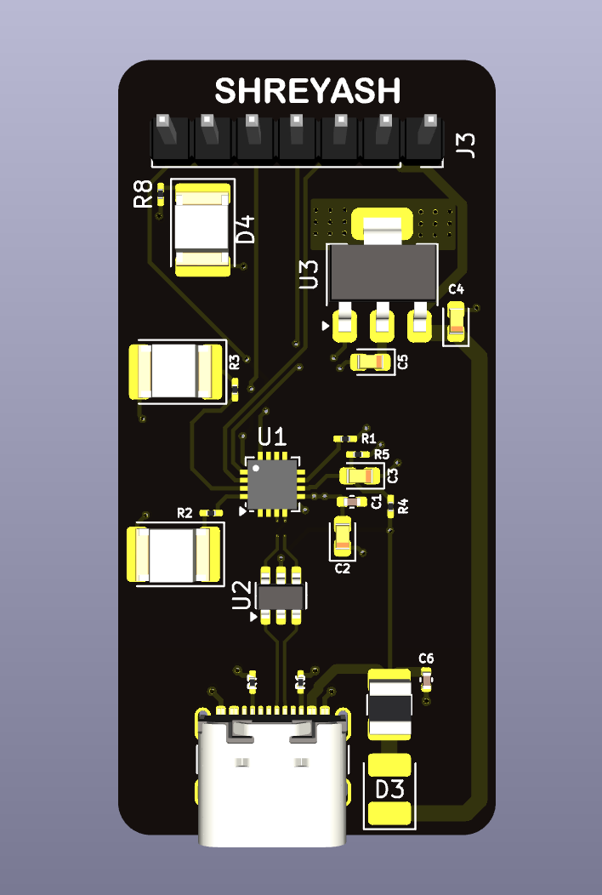
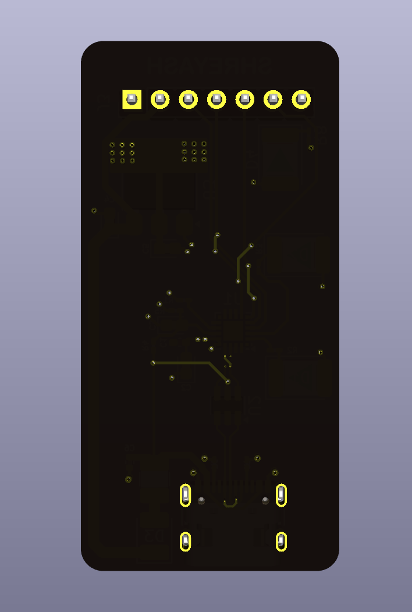
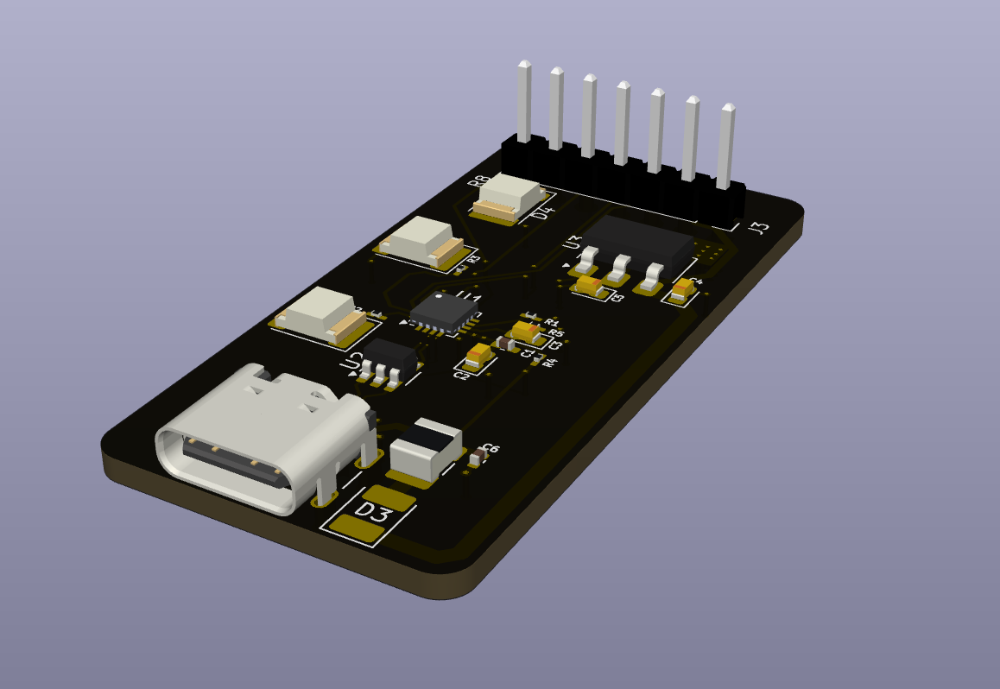

# 🔌 USB-UART Converter Board

A custom **USB to UART converter PCB** designed in **KiCad** for embedded development and debugging.  
This board allows communication between a computer and microcontrollers using the **UART serial interface**.

The project demonstrates the complete hardware design workflow including schematic design, PCB layout, 3D visualization, and version-controlled hardware development.

---

## 🧠 Project Overview

The **USB-UART board** is designed to provide reliable serial communication between a computer and embedded systems.

Typical use cases include:

- Programming microcontrollers
- Serial debugging
- Firmware flashing
- Communication with development boards
- Embedded system testing

This board acts as a bridge between **USB (PC)** and **UART (TX/RX)** signals used by most microcontrollers.

---

## 🛠 Tools Used

- **KiCad** – Schematic capture and PCB design  
- **Custom footprints and symbols**
- **Git & GitHub** – Version control  
- **3D PCB rendering** – Board visualization  

---

## ⚙️ Features

- USB interface for computer connectivity
- UART communication (TX / RX)
- Compact PCB layout
- Designed for easy integration with development boards
- Suitable for debugging and firmware upload

---

## 🏗 PCB Design

Key design considerations:

- Clean USB routing
- Proper decoupling capacitors
- Compact component placement
- Ground plane for signal stability
- DRC-clean PCB layout

---

## 🖼 Board Preview

### Front View

### Back View

### 3D View

---

## 📂 Repository Structure
USB-UART
│
├── Main/ # KiCad project files
│ ├── Main.kicad_pcb
│ ├── Main.kicad_pro
│ ├── Main.kicad_sch
│ └── Main-backups/
│
├── FRONT.png # PCB front render
├── BACK.png # PCB back render
├── ANGLE-1.png # 3D board view
├── ANGLE-2.png # 3D board view
│
└── README.md

---

## 🎯 Learning Outcomes

Through this project:

- Designed a complete USB-to-UART interface board
- Practiced PCB layout and routing techniques
- Learned hardware documentation practices
- Used GitHub for hardware project version control
- Generated production-ready PCB files

---

## 🚀 Future Improvements

Possible upgrades for the next version:

- Add auto-reset circuit for microcontroller flashing
- Add TX/RX indicator LEDs
- Improve ESD protection on USB lines
- Add voltage selection (3.3V / 5V)
- Convert to smaller form factor

---

## 📜 License

This project is open hardware and intended for educational and experimental use
